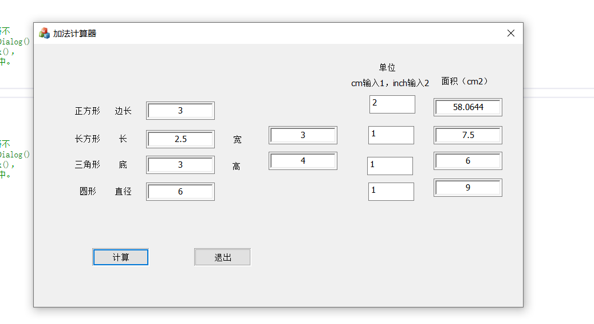

**1. Project Title**：基于**Visual Studio MFC**交互的面积计算器
本项目在基础面积计算器的基础上实现了<label style="color:red">人机交互界面</label>，操作简便直观，支持cm与inch两种单位输入，也是有area.exe应用程序方便使用。
**2. Getting Started**：基于VC的MFC，设计交互界面并写入函数进行操控。在使用时需要在Visual Studio中安装MFC部件方可运行程序。
**3. Running the tests**：直接打开应用程序进行计算操作，并测试单位换算是否有效，由于作者编程不熟练，<label style="color:red">控件、函数与变量的命名不规则</label>，无法由命名直观看出作用，<label style="color:red">请结合资源文件中的操作面板进行代码分析</label>，对应控件与变量命名。
**4. Usage**：打开程序，直接在编辑框中输入参数，然后点击<kbd>计算</kbd>按钮，最后点击<kbd>退出</kbd>按钮结束程序运行。
**5. Versioning**：该程序软件有两个版本，版本不支持单位换算，只能以`cm`为单位进行输入参数，2.0版本有`cm`与`inch`两种单位可供选择，默认以`cm`为单位，`cm`为1，`inch`为2，只需在单位编辑框中输入1或者2即可。
**6. Authors**：邓一帆
交互界面图片
<center></center>
***
```C++
// MFCApplication1Dlg.cpp: 实现文件
//

#include "pch.h"
#include "framework.h"
#include "MFCApplication1.h"
#include "MFCApplication1Dlg.h"
#include "afxdialogex.h"

#ifdef _DEBUG
#define new DEBUG_NEW
#endif


// 用于应用程序“关于”菜单项的 CAboutDlg 对话框

class CAboutDlg : public CDialogEx
{
public:
	CAboutDlg();
// 对话框数据
#ifdef AFX_DESIGN_TIME
	enum { IDD = IDD_ABOUTBOX };
#endif
	protected:
	virtual void DoDataExchange(CDataExchange* pDX);    // DDX/DDV 支持
// 实现
protected:
	DECLARE_MESSAGE_MAP()
public:
	afx_msg void OnBnClickedAddButton1();
};

CAboutDlg::CAboutDlg() : CDialogEx(IDD_ABOUTBOX)
{
}

void CAboutDlg::DoDataExchange(CDataExchange* pDX)
{
	CDialogEx::DoDataExchange(pDX);
}

BEGIN_MESSAGE_MAP(CAboutDlg, CDialogEx)
	ON_BN_CLICKED(IDC_ADD_BUTTON1, &CAboutDlg::OnBnClickedAddButton1)
END_MESSAGE_MAP()


// CMFCApplication1Dlg 对话框


CMFCApplication1Dlg::CMFCApplication1Dlg(CWnd* pParent /*=nullptr*/)
	: CDialogEx(IDD_MFCAPPLICATION1_DIALOG, pParent)
	, m_editSummand(0)
	, m_editSum(0)
	, m_length_c(0)
	, m_di(0)
	, m_circle(0)
	, m_width(0)
	, m_high(0)
	, m_area_c(0)
	, m_area_s(0)
	, m_area_y(0)
	, m_unit1(1)
	, m_unit2(1)
	, m_unit3(1)
	, m_unit4(1)
{
	m_hIcon = AfxGetApp()->LoadIcon(IDR_MAINFRAME);
}

void CMFCApplication1Dlg::DoDataExchange(CDataExchange* pDX)
{
	CDialogEx::DoDataExchange(pDX);
	DDX_Text(pDX, IDC_SUMMAND_EDIT1, m_editSummand);
	DDX_Text(pDX, IDC_SUM_EDIT, m_editSum);
	DDX_Text(pDX, IDC_SUMMAND_EDIT2, m_length_c);
	DDX_Text(pDX, IDC_SUMMAND_EDIT3, m_di);
	DDX_Text(pDX, IDC_SUMMAND_EDIT4, m_circle);
	DDX_Text(pDX, IDC_ADDEND_EDIT2, m_width);
	DDX_Text(pDX, IDC_ADDEND_EDIT3, m_high);
	DDX_Text(pDX, IDC_SUM_EDIT2, m_area_c);
	DDX_Text(pDX, IDC_SUM_EDIT3, m_area_s);
	DDX_Text(pDX, IDC_SUM_EDIT4, m_area_y);
	DDX_Text(pDX, IDC_EDIT3, m_unit1);
	DDX_Text(pDX, IDC_EDIT1, m_unit2);
	DDX_Text(pDX, IDC_EDIT2, m_unit3);
	DDX_Text(pDX, IDC_EDIT4, m_unit4);
}

BEGIN_MESSAGE_MAP(CMFCApplication1Dlg, CDialogEx)
ON_WM_SYSCOMMAND()
ON_WM_PAINT()
ON_WM_QUERYDRAGICON()
ON_STN_CLICKED(IDC_SUMMAND_STATIC, &CMFCApplication1Dlg::OnStnClickedSummandStatic)
ON_BN_CLICKED(IDC_ADD_BUTTON1, &CMFCApplication1Dlg::OnBnClickedAddButton1)
ON_BN_CLICKED(IDCANCEL, &CMFCApplication1Dlg::OnBnClickedCancel)
ON_EN_CHANGE(IDC_SUMMAND_EDIT1, &CMFCApplication1Dlg::OnEnChangeSummandEdit1)
ON_EN_CHANGE(IDC_SUM_EDIT, &CMFCApplication1Dlg::OnEnChangeSumEdit)
ON_EN_UPDATE(IDC_SUM_EDIT, &CMFCApplication1Dlg::OnEnUpdateSumEdit)
ON_EN_UPDATE(IDC_SUM_EDIT, &CMFCApplication1Dlg::OnEnUpdateSumEdit)
ON_EN_CHANGE(IDC_SUMMAND_EDIT1, &CMFCApplication1Dlg::OnEnChangeSummandEdit1)
ON_EN_CHANGE(IDC_SUMMAND_EDIT3, &CMFCApplication1Dlg::OnEnChangeSummandEdit3)
ON_EN_CHANGE(IDC_SUMMAND_EDIT4, &CMFCApplication1Dlg::OnEnChangeSummandEdit4)
ON_EN_CHANGE(IDC_ADDEND_EDIT2, &CMFCApplication1Dlg::OnEnChangeAddendEdit2)
ON_EN_CHANGE(IDC_ADDEND_EDIT3, &CMFCApplication1Dlg::OnEnChangeAddendEdit3)
ON_EN_CHANGE(IDC_SUM_EDIT, &CMFCApplication1Dlg::OnEnChangeSumEdit)
ON_EN_CHANGE(IDC_SUM_EDIT2, &CMFCApplication1Dlg::OnEnChangeSumEdit2)
ON_EN_CHANGE(IDC_SUM_EDIT3, &CMFCApplication1Dlg::OnEnChangeSumEdit3)
ON_EN_CHANGE(IDC_SUM_EDIT4, &CMFCApplication1Dlg::OnEnChangeSumEdit4)
ON_EN_CHANGE(IDC_EDIT3, &CMFCApplication1Dlg::OnEnChangeEdit3)
ON_EN_CHANGE(IDC_EDIT2, &CMFCApplication1Dlg::OnEnChangeEdit2)
END_MESSAGE_MAP()


// CMFCApplication1Dlg 消息处理程序

BOOL CMFCApplication1Dlg::OnInitDialog()
{
	CDialogEx::OnInitDialog();

	// 将“关于...”菜单项添加到系统菜单中。

	// IDM_ABOUTBOX 必须在系统命令范围内。
	ASSERT((IDM_ABOUTBOX & 0xFFF0) == IDM_ABOUTBOX);
	ASSERT(IDM_ABOUTBOX < 0xF000);
	CMenu* pSysMenu = GetSystemMenu(FALSE);
	if (pSysMenu != nullptr)
	{
		BOOL bNameValid;
		CString strAboutMenu;
		bNameValid = strAboutMenu.LoadString(IDS_ABOUTBOX);
		ASSERT(bNameValid);
		if (!strAboutMenu.IsEmpty())
		{
			pSysMenu->AppendMenu(MF_SEPARATOR);
			pSysMenu->AppendMenu(MF_STRING, IDM_ABOUTBOX, strAboutMenu);
		}
	}

	// 设置此对话框的图标。  当应用程序主窗口不是对话框时，框架将自动
	//  执行此操作
	SetIcon(m_hIcon, TRUE);			// 设置大图标
	SetIcon(m_hIcon, FALSE);		// 设置小图标

	// TODO: 在此添加额外的初始化代码

	return TRUE;  // 除非将焦点设置到控件，否则返回 TRUE
}

void CMFCApplication1Dlg::OnSysCommand(UINT nID, LPARAM lParam)
{
	if ((nID & 0xFFF0) == IDM_ABOUTBOX)
	{
		CAboutDlg dlgAbout;
		dlgAbout.DoModal();
	}
	else
	{
		CDialogEx::OnSysCommand(nID, lParam);
	}
}

// 如果向对话框添加最小化按钮，则需要下面的代码
//  来绘制该图标。  对于使用文档/视图模型的 MFC 应用程序，
//  这将由框架自动完成。

void CMFCApplication1Dlg::OnPaint()
{
	if (IsIconic())
	{
		CPaintDC dc(this); // 用于绘制的设备上下文

		SendMessage(WM_ICONERASEBKGND, reinterpret_cast<WPARAM>(dc.GetSafeHdc()), 0);

		// 使图标在工作区矩形中居中
		int cxIcon = GetSystemMetrics(SM_CXICON);
		int cyIcon = GetSystemMetrics(SM_CYICON);
		CRect rect;
		GetClientRect(&rect);
		int x = (rect.Width() - cxIcon + 1) / 2;
		int y = (rect.Height() - cyIcon + 1) / 2;

		// 绘制图标
		dc.DrawIcon(x, y, m_hIcon);
	}
	else
	{
		CDialogEx::OnPaint();
	}
}

//当用户拖动最小化窗口时系统调用此函数取得光标
//显示。
HCURSOR CMFCApplication1Dlg::OnQueryDragIcon()
{
	return static_cast<HCURSOR>(m_hIcon);
}


void CMFCApplication1Dlg::OnStnClickedSummandStatic()
{
	// TODO: 在此添加控件通知处理程序代码
}


void CMFCApplication1Dlg::OnEnChangeEdit1()
{
	// TODO:  如果该控件是 RICHEDIT 控件，它将不
	// 发送此通知，除非重写 CDialogEx::OnInitDialog()
	// 函数并调用 CRichEditCtrl().SetEventMask()，
	// 同时将 ENM_CHANGE 标志“或”运算到掩码中。

	// TODO:  在此添加控件通知处理程序代码
}


void CMFCApplication1Dlg::OnEnChangeSummandEdit2()
{
	// TODO:  如果该控件是 RICHEDIT 控件，它将不
	// 发送此通知，除非重写 CDialogEx::OnInitDialog()
	// 函数并调用 CRichEditCtrl().SetEventMask()，
	// 同时将 ENM_CHANGE 标志“或”运算到掩码中。

	// TODO:  在此添加控件通知处理程序代码
}


void CMFCApplication1Dlg::OnStnClickedSummandStatic2()
{
	// TODO: 在此添加控件通知处理程序代码
}


void CAboutDlg::OnBnClickedAddButton1()
{
	// TODO: 在此添加控件通知处理程序代码
}


void CMFCApplication1Dlg::OnBnClickedAddButton1()
{
	// TODO: 在此添加控件通知处理程序代码
	UpdateData(TRUE);
	if (m_unit1 == 2)
		m_editSum = pow(m_editSummand * 2.54,2);
	else
	{
		m_editSum = m_editSummand * m_editSummand;
	}
	if (m_unit2 == 2)
		m_area_c = m_length_c*2.54*m_width*2.54;
	else
	{
		m_area_c = m_length_c * m_width;
	}
	if (m_unit3 == 2)
		m_area_s = m_di*2.54*2.54*m_high/2;
	else
	{
		m_area_s = m_di * m_high/2;
	}
	if (m_unit4 == 2)
		m_area_y = pow((m_circle*2.54 / 2), 2);
	else
	{
		m_area_y = pow((m_circle / 2), 2);
	}
	UpdateData(FALSE);

}


void CMFCApplication1Dlg::OnBnClickedCancel()
{
	// TODO: 在此添加控件通知处理程序代码
	CDialogEx::OnCancel();
}


//void CMFCApplication1Dlg::OnEnChangeSummandEdit1()
//{
//	// TODO:  如果该控件是 RICHEDIT 控件，它将不
//	// 发送此通知，除非重写 CDialogEx::OnInitDialog()
//	// 函数并调用 CRichEditCtrl().SetEventMask()，
//	// 同时将 ENM_CHANGE 标志“或”运算到掩码中。
//
//	// TODO:  在此添加控件通知处理程序代码
//}


//void CMFCApplication1Dlg::OnEnChangeAddendEdit()
//{
//	// TODO:  如果该控件是 RICHEDIT 控件，它将不
//	// 发送此通知，除非重写 CDialogEx::OnInitDialog()
//	// 函数并调用 CRichEditCtrl().SetEventMask()，
//	// 同时将 ENM_CHANGE 标志“或”运算到掩码中。
//
//	// TODO:  在此添加控件通知处理程序代码
//}


//void CMFCApplication1Dlg::OnEnChangeSumEdit()
//{
//	// TODO:  如果该控件是 RICHEDIT 控件，它将不
//	// 发送此通知，除非重写 CDialogEx::OnInitDialog()
//	// 函数并调用 CRichEditCtrl().SetEventMask()，
//	// 同时将 ENM_CHANGE 标志“或”运算到掩码中。
//
//	// TODO:  在此添加控件通知处理程序代码
//}


//void CMFCApplication1Dlg::OnEnUpdateSumEdit()
//{
//	// TODO:  如果该控件是 RICHEDIT 控件，它将不
//	// 发送此通知，除非重写 CDialogEx::OnInitDialog()
//	// 函数，以将 EM_SETEVENTMASK 消息发送到该控件，
//	// 同时将 ENM_UPDATE 标志“或”运算到 lParam 掩码中。
//
//	// TODO:  在此添加控件通知处理程序代码
//}


void CMFCApplication1Dlg::OnEnUpdateSumEdit()
{
	// TODO:  如果该控件是 RICHEDIT 控件，它将不
	// 发送此通知，除非重写 CDialogEx::OnInitDialog()
	// 函数，以将 EM_SETEVENTMASK 消息发送到该控件，
	// 同时将 ENM_UPDATE 标志“或”运算到 lParam 掩码中。

	// TODO:  在此添加控件通知处理程序代码
}


void CMFCApplication1Dlg::OnEnChangeSummandEdit1()
{
	// TODO:  如果该控件是 RICHEDIT 控件，它将不
	// 发送此通知，除非重写 CDialogEx::OnInitDialog()
	// 函数并调用 CRichEditCtrl().SetEventMask()，
	// 同时将 ENM_CHANGE 标志“或”运算到掩码中。

	// TODO:  在此添加控件通知处理程序代码
}


void CMFCApplication1Dlg::OnEnChangeSummandEdit3()
{
	// TODO:  如果该控件是 RICHEDIT 控件，它将不
	// 发送此通知，除非重写 CDialogEx::OnInitDialog()
	// 函数并调用 CRichEditCtrl().SetEventMask()，
	// 同时将 ENM_CHANGE 标志“或”运算到掩码中。

	// TODO:  在此添加控件通知处理程序代码
}


void CMFCApplication1Dlg::OnEnChangeSummandEdit4()
{
	// TODO:  如果该控件是 RICHEDIT 控件，它将不
	// 发送此通知，除非重写 CDialogEx::OnInitDialog()
	// 函数并调用 CRichEditCtrl().SetEventMask()，
	// 同时将 ENM_CHANGE 标志“或”运算到掩码中。

	// TODO:  在此添加控件通知处理程序代码
}


void CMFCApplication1Dlg::OnEnChangeAddendEdit2()
{
	// TODO:  如果该控件是 RICHEDIT 控件，它将不
	// 发送此通知，除非重写 CDialogEx::OnInitDialog()
	// 函数并调用 CRichEditCtrl().SetEventMask()，
	// 同时将 ENM_CHANGE 标志“或”运算到掩码中。

	// TODO:  在此添加控件通知处理程序代码
}


void CMFCApplication1Dlg::OnEnChangeAddendEdit3()
{
	// TODO:  如果该控件是 RICHEDIT 控件，它将不
	// 发送此通知，除非重写 CDialogEx::OnInitDialog()
	// 函数并调用 CRichEditCtrl().SetEventMask()，
	// 同时将 ENM_CHANGE 标志“或”运算到掩码中。

	// TODO:  在此添加控件通知处理程序代码
}


void CMFCApplication1Dlg::OnEnChangeSumEdit()
{
	// TODO:  如果该控件是 RICHEDIT 控件，它将不
	// 发送此通知，除非重写 CDialogEx::OnInitDialog()
	// 函数并调用 CRichEditCtrl().SetEventMask()，
	// 同时将 ENM_CHANGE 标志“或”运算到掩码中。

	// TODO:  在此添加控件通知处理程序代码
}


void CMFCApplication1Dlg::OnEnChangeSumEdit2()
{
	// TODO:  如果该控件是 RICHEDIT 控件，它将不
	// 发送此通知，除非重写 CDialogEx::OnInitDialog()
	// 函数并调用 CRichEditCtrl().SetEventMask()，
	// 同时将 ENM_CHANGE 标志“或”运算到掩码中。

	// TODO:  在此添加控件通知处理程序代码
}


void CMFCApplication1Dlg::OnEnChangeSumEdit3()
{
	// TODO:  如果该控件是 RICHEDIT 控件，它将不
	// 发送此通知，除非重写 CDialogEx::OnInitDialog()
	// 函数并调用 CRichEditCtrl().SetEventMask()，
	// 同时将 ENM_CHANGE 标志“或”运算到掩码中。

	// TODO:  在此添加控件通知处理程序代码
}


void CMFCApplication1Dlg::OnEnChangeSumEdit4()
{
	// TODO:  如果该控件是 RICHEDIT 控件，它将不
	// 发送此通知，除非重写 CDialogEx::OnInitDialog()
	// 函数并调用 CRichEditCtrl().SetEventMask()，
	// 同时将 ENM_CHANGE 标志“或”运算到掩码中。

	// TODO:  在此添加控件通知处理程序代码
}


void CMFCApplication1Dlg::OnEnChangeEdit3()
{
	// TODO:  如果该控件是 RICHEDIT 控件，它将不
	// 发送此通知，除非重写 CDialogEx::OnInitDialog()
	// 函数并调用 CRichEditCtrl().SetEventMask()，
	// 同时将 ENM_CHANGE 标志“或”运算到掩码中。

	// TODO:  在此添加控件通知处理程序代码
}


void CMFCApplication1Dlg::OnEnChangeEdit2()
{
	// TODO:  如果该控件是 RICHEDIT 控件，它将不
	// 发送此通知，除非重写 CDialogEx::OnInitDialog()
	// 函数并调用 CRichEditCtrl().SetEventMask()，
	// 同时将 ENM_CHANGE 标志“或”运算到掩码中。

	// TODO:  在此添加控件通知处理程序代码
}
```